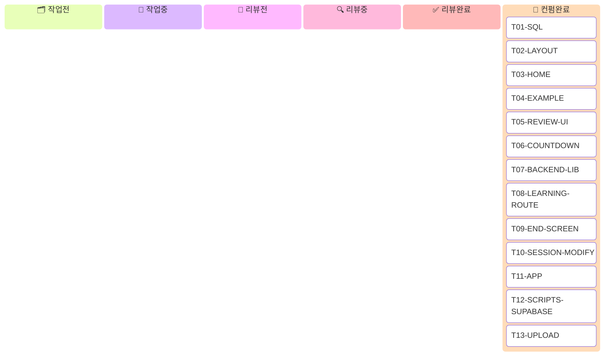

# TASK_PLAN.md

> 이 파일은 **에이전트 협업 작업 계획서**다.
> 에이전트는 작업 착수/완료 시 칸반보드와 각 태스크의 `상태` 필드를 **이 파일에 직접 편집**해 기록한다.

---

## 칸반 보드

> 에이전트는 상태 전환 시 해당 카드를 올바른 컬럼으로 이동시킨다.
> 작업중·리뷰중 카드는 `taskId@{assigned: 'AgentID'}` 로 담당자를 표기한다.



### 보드 편집 규칙
1. 착수 시 → 카드를 `작업전`에서 `작업중`으로 이동, `@{assigned: 'AgentID'}` 추가
2. 구현 완료 시 → `작업중` → `리뷰전`
3. 리뷰 시작 시 → `리뷰전` → `리뷰중`, `@{assigned: 'AgentID'}` 추가
4. 리뷰 완료 시 → `리뷰중` → `리뷰완료`
5. 사람 컨펌 시 → `리뷰완료` → `컨펌완료`
6. **`작업중`에 이미 있는 태스크는 착수 금지**

---

## 상태 프로토콜

에이전트는 태스크 착수/완료 시 칸반 보드 **및** 각 태스크 명세의 `상태` 필드를 모두 편집한다.

| 상태 표기 | 의미 |
|-----------|------|
| `[ 작업전 ]` | 미착수 (기본값) |
| `[ 작업중 : AgentID ]` | 해당 에이전트가 작업 중 |
| `[ 리뷰전 ]` | 구현 완료, 리뷰어 대기 |
| `[ 리뷰중 : AgentID ]` | 해당 에이전트가 리뷰 중 |
| `[ 리뷰완료 ]` | 리뷰 통과, 사람 컨펌 대기 |
| `[ 컨펌완료 ]` | 최종 완료 |

**규칙:**
- 동일 파일을 두 에이전트가 동시에 수정하면 안 된다.
- 의존 태스크가 `[ 컨펌완료 ]`가 아니면 착수하지 않는다.
- 각 태스크는 "검증" 항목을 직접 확인한 후 `[ 리뷰전 ]`으로 올린다.

---

## 의존성 그래프

```
독립 실행 가능 (즉시 착수):
  T01-SQL
  T02-LAYOUT
  T03-HOME
  T04-EXAMPLE
  T05-REVIEW-UI
  T06-COUNTDOWN

T01-SQL 완료 후:
  T07-BACKEND-LIB
  └─ T08-LEARNING-ROUTE

T06-COUNTDOWN 완료 후:
  T09-END-SCREEN
  T10-SESSION-MODIFY
  └─ T11-APP  (T09 + T10 모두 완료 후)

CONTENT1 완료 + T01-SQL 완료 후:
  T12-SCRIPTS-SUPABASE
  └─ T13-UPLOAD  (코드만; 실행은 사람이)
```

---

## 태스크 목록

---

### T01-SQL — Supabase Migration SQL 파일 생성

**상태:** `[ 컨펌완료 ]`
**전제:** 없음
**소요:** ~5분

**목표 파일:**
```
supabase/migrations/20260224000000_create_expressions_and_stories.sql  (신규)
```

**구현:**
아래 내용 그대로 파일에 저장한다.

```sql
-- expressions: 표현 + 의미 (1개 표현 = 1행)
CREATE TABLE expressions (
  id             TEXT PRIMARY KEY,
  phrase         TEXT NOT NULL,
  sense_label_ko TEXT NOT NULL,
  domain         TEXT NOT NULL DEFAULT 'general',
  meaning        JSONB NOT NULL,
  selection_meta JSONB NOT NULL,
  created_at     TIMESTAMPTZ DEFAULT NOW()
);

-- stories: 스토리 (1개 표현 = N개 스토리)
CREATE TABLE stories (
  id             UUID PRIMARY KEY DEFAULT gen_random_uuid(),
  expression_id  TEXT NOT NULL REFERENCES expressions(id) ON DELETE CASCADE,
  step1_sentence TEXT NOT NULL,
  step2_story    TEXT NOT NULL,
  step3_story    TEXT NOT NULL,
  topic_tag      TEXT,
  mood_tag       TEXT,
  created_at     TIMESTAMPTZ DEFAULT NOW()
);

CREATE INDEX idx_expressions_phrase ON expressions(phrase);
CREATE INDEX idx_stories_expression_id ON stories(expression_id);
```

**검증:**
- 파일이 올바른 경로에 존재하는지 확인
- SQL 문법 오류 없음 (수동 확인)
- ⚠️ Supabase Dashboard에서 실제 실행은 사람이 한다

---

### T02-LAYOUT — LearningFlowLayout 배경색 변경

**상태:** `[ 컨펌완료 ]`
**전제:** 없음
**소요:** ~5분

**목표 파일:**
```
Product/apps/mobile/screens/layouts/LearningFlowLayout.tsx  (수정)
```

**현재 코드 (26번째 줄 근처):**
```tsx
<SafeAreaView style={{ flex: 1, backgroundColor: '#f5f7fb' }}>
```

**변경 후:**
```tsx
<SafeAreaView style={{ flex: 1, backgroundColor: '#FAF7F2' }}>
```

변경 사항: `'#f5f7fb'` → `'#FAF7F2'` (한 곳만)

이 파일을 수정하면 LearningFlowLayout을 사용하는
ExampleFlowScreen, MeaningScreen, MeaningGateScreen의 배경이 자동으로 변경된다.

**검증:**
- 파일에서 `#f5f7fb` 가 사라지고 `#FAF7F2` 가 들어갔는지 확인
- 나머지 코드 변경 없음

---

### T03-HOME — HomeScreen 크림 테마

**상태:** `[ 컨펌완료 ]`
**전제:** 없음
**소요:** ~15분

**목표 파일:**
```
Product/apps/mobile/screens/HomeScreen.tsx  (수정)
```

**변경 사항 4가지:**

**1) 배경색**
```tsx
// 현재
<Box className="flex-1 items-center justify-center bg-background-50 px-4">

// 변경 후
<Box className="flex-1 items-center justify-center px-4" style={{ backgroundColor: '#FAF7F2' }}>
```

**2) Input border 색상**
Input 컴포넌트에 `style` prop 추가:
```tsx
// 현재
<Input size="lg" variant="outline">

// 변경 후
<Input size="lg" variant="outline" style={{ borderColor: '#E8E0D5', backgroundColor: '#FFFFFF' }}>
```

**3) "단어 검색" 버튼**
```tsx
// 현재
<Button size="lg" action="primary" onPress={handleSearchPress} isDisabled={isSearching}>

// 변경 후
<Button
  size="lg"
  action="primary"
  onPress={handleSearchPress}
  isDisabled={isSearching}
  style={{ backgroundColor: '#D97706' }}
>
```

**4) "복습하기" 버튼**
```tsx
// 현재
<Button size="lg" action="secondary" onPress={onReviewPress}>
  <ButtonText>복습하기</ButtonText>
</Button>

// 변경 후
<Button
  size="lg"
  action="secondary"
  onPress={onReviewPress}
  style={{ backgroundColor: '#FFFFFF', borderColor: '#D97706' }}
>
  <ButtonText style={{ color: '#D97706' }}>복습하기</ButtonText>
</Button>
```

에러 텍스트(`color: '#dc2626'`)는 이미 올바르므로 변경하지 않는다.

**검증:**
- `bg-background-50` 클래스가 제거되었는지 확인
- 4가지 변경 사항 모두 적용 확인

---

### T04-EXAMPLE — ExampleFlowScreen 색상 + StepIndicator

**상태:** `[ 컨펌완료 ]`
**전제:** T02-LAYOUT 컨펌완료 (배경은 LearningFlowLayout에서 처리됨)
**소요:** ~30분

**목표 파일:**
```
Product/apps/mobile/screens/ExampleFlowScreen.tsx  (수정)
```

**변경 사항 4가지:**

**1) StepIndicator 컴포넌트 추가**

파일 상단 import 영역 아래, 컴포넌트 정의 전에 추가:

```tsx
function StepIndicator({ current }: { current: ExampleStep }) {
  return (
    <View style={{ flexDirection: 'row', alignItems: 'center', justifyContent: 'center' }}>
      {([1, 2, 3] as ExampleStep[]).map((i) => (
        <React.Fragment key={i}>
          <View
            style={{
              width: 8,
              height: 8,
              borderRadius: 4,
              backgroundColor: i <= current ? '#D97706' : '#E8E0D5',
            }}
          />
          {i < 3 && (
            <View
              style={{
                width: 32,
                height: 2,
                backgroundColor: i < current ? '#D97706' : '#E8E0D5',
              }}
            />
          )}
        </React.Fragment>
      ))}
    </View>
  );
}
```

`React.Fragment`를 위해 파일 상단 import에 `React` 추가:
```tsx
import React, { useEffect, useMemo, useRef, useState } from 'react';
```

**2) StepIndicator 배치**

`ExampleFlowScreen` return 내부, `<VStack>` 첫 번째 자식으로 추가:
```tsx
<VStack className="gap-5" style={{ width: contentWidth }}>
  <StepIndicator current={step} />   {/* ← 추가 */}
  <Text size="xl" bold>
    {STEP_LABEL[step]}
  </Text>
  ...
```

**3) 표현 강조 색상 변경**

하이라이트 텍스트 렌더 부분에서 색상 변경:
```tsx
// 현재 없음 (bold만 있음) → 매칭 세그먼트에 색상 추가
<Text
  key={`${segment.text}-${index}`}
  size="md"
  bold={segment.isMatch}
  style={segment.isMatch ? { color: '#D97706' } : undefined}
>
  {segment.text}
</Text>
```

**4) 이미지 플레이스홀더 배경색 변경**

```tsx
// 현재
backgroundColor: '#e5e7eb',

// 변경 후
backgroundColor: '#E8E0D5',
```

**5) "다음" 버튼 색상**

```tsx
// 현재
<Button size="lg" action="primary" onPress={...}>

// 변경 후
<Button size="lg" action="primary" onPress={...} style={{ backgroundColor: '#D97706' }}>
```

**6) "뜻 보러 가기" 버튼 색상**

```tsx
// 현재
<Button size="lg" action="secondary" onPress={onMeaningPress}>
  <ButtonText>뜻 보러 가기</ButtonText>
</Button>

// 변경 후
<Button
  size="lg"
  action="secondary"
  onPress={onMeaningPress}
  style={{ backgroundColor: '#FFFFFF', borderColor: '#D97706' }}
>
  <ButtonText style={{ color: '#D97706' }}>뜻 보러 가기</ButtonText>
</Button>
```

**검증:**
- StepIndicator가 VStack 최상단에 배치되었는지 확인
- step 1: 점 하나만 amber, 나머지 회색 / step 2: 점 두 개 amber / step 3: 전부 amber
- 하이라이트 텍스트 `#D97706` 적용 확인
- 이미지 플레이스홀더 `#E8E0D5` 적용 확인
- 버튼 색상 확인

---

### T05-REVIEW-UI — ReviewSessionScreen 색상 변경

**상태:** `[ 컨펌완료 ]`
**전제:** 없음 (색상만 변경; End 버튼/navigate는 T10-SESSION-MODIFY)
**소요:** ~20분

**목표 파일:**
```
Product/apps/mobile/screens/ReviewSessionScreen.tsx  (수정)
```

**변경 사항:**

**1) 배경색 전부 변경**
파일에서 `#f5f7fb` 를 모두 `#FAF7F2` 로 교체 (총 3곳: size-select, complete, reading phase의 SafeAreaView).

**2) 표현 강조 텍스트 색상**
reading phase에서 하이라이트 텍스트:
```tsx
// 현재
style={segment.isMatch ? { color: '#2563eb' } : undefined}

// 변경 후
style={segment.isMatch ? { color: '#D97706' } : undefined}
```

**3) "다음" 버튼 (isLast=false인 경우)**
```tsx
// 현재
<Button size="lg" action={isLast ? 'secondary' : 'primary'} onPress={handleNext}>
  <ButtonText>{isLast ? '복습 완료' : '다음'}</ButtonText>
</Button>

// 변경 후
<Button
  size="lg"
  action={isLast ? 'secondary' : 'primary'}
  onPress={handleNext}
  style={isLast
    ? { backgroundColor: '#FFFFFF', borderColor: '#D97706' }
    : { backgroundColor: '#D97706' }
  }
>
  <ButtonText style={isLast ? { color: '#D97706' } : undefined}>
    {isLast ? '복습 완료' : '다음'}
  </ButtonText>
</Button>
```

**4) size-select phase의 "홈으로 이동" 버튼**
```tsx
// 현재
<Button size="lg" action="secondary" onPress={onClose}>
  <ButtonText>홈으로 이동</ButtonText>
</Button>

// 변경 후
<Button
  size="lg"
  action="secondary"
  onPress={onClose}
  style={{ backgroundColor: '#FFFFFF', borderColor: '#D97706' }}
>
  <ButtonText style={{ color: '#D97706' }}>홈으로 이동</ButtonText>
</Button>
```

**⚠️ 주의:** `phase === 'complete'` 블록은 T10-SESSION-MODIFY에서 삭제할 것이므로 지금은 건드리지 않는다.

**검증:**
- 파일에서 `#f5f7fb` 가 사라졌는지 확인
- `#2563eb` 가 `#D97706` 로 바뀌었는지 확인

---

### T06-COUNTDOWN — ReviewCountdownScreen 신규 생성

**상태:** `[ 컨펌완료 ]`
**전제:** 없음
**소요:** ~20분

**목표 파일:**
```
Product/apps/mobile/screens/ReviewCountdownScreen.tsx  (신규)
```

**구현:**

```tsx
import { useEffect, useState } from 'react';
import { TouchableOpacity, View } from 'react-native';
import { SafeAreaView } from 'react-native-safe-area-context';

import { Text } from '@/components/ui/text';

const REVIEW_COUNTDOWN_SECONDS = 3;

type ReviewCountdownScreenProps = {
  onStart: () => void;
};

export function ReviewCountdownScreen({ onStart }: ReviewCountdownScreenProps) {
  const [count, setCount] = useState<number>(REVIEW_COUNTDOWN_SECONDS);

  useEffect(() => {
    const interval = setInterval(() => {
      setCount((prev) => {
        if (prev <= 1) {
          clearInterval(interval);
          onStart();
          return 0;
        }
        return prev - 1;
      });
    }, 1000);

    return () => clearInterval(interval);
  }, [onStart]);

  return (
    <SafeAreaView style={{ flex: 1, backgroundColor: '#FAF7F2' }}>
      <TouchableOpacity
        style={{ flex: 1, alignItems: 'center', justifyContent: 'center' }}
        onPress={onStart}
        activeOpacity={1}
      >
        <View style={{ alignItems: 'center', gap: 24 }}>
          <Text size="xl" style={{ color: '#2C2C2C' }}>
            복습을 시작합니다
          </Text>
          <Text
            bold
            style={{ fontSize: 80, lineHeight: 96, color: '#D97706' }}
          >
            {count}
          </Text>
          <Text size="sm" style={{ color: '#6B5C4C' }}>
            탭하면 바로 시작
          </Text>
        </View>
      </TouchableOpacity>
    </SafeAreaView>
  );
}
```

**주의:**
- `navigation.replace`는 사용하지 않고 `onStart` prop callback으로 처리한다.
- App.tsx에서 `onStart={() => navigation.replace('ReviewSession')}` 로 전달한다.

**검증:**
- 파일이 올바른 경로에 존재하는지 확인
- TypeScript 타입 오류 없음 (export function, props 타입 정확)

---

### T07-BACKEND-LIB — backend/lib/supabase.js 신규 생성

**상태:** `[ 컨펌완료 ]`
**전제:** T01-SQL 컨펌완료 (@supabase/supabase-js는 이미 설치됨)
**소요:** ~30분

**목표 파일:**
```
Product/apps/backend/lib/supabase.js  (신규)
```

**구현:**

```javascript
'use strict';

const { createClient } = require('@supabase/supabase-js');

/** @type {import('@supabase/supabase-js').SupabaseClient | null} */
let _client = null;

/**
 * Supabase 클라이언트 싱글턴 반환
 * @returns {import('@supabase/supabase-js').SupabaseClient}
 */
function createSupabaseClient() {
  if (_client) return _client;
  const url = process.env.SUPABASE_URL;
  const key = process.env.SUPABASE_SERVICE_ROLE_KEY;
  if (!url || !key) throw new Error('Missing SUPABASE_URL or SUPABASE_SERVICE_ROLE_KEY');
  _client = createClient(url, key);
  return _client;
}

/**
 * phrase로 expression + story 한 쌍 조회.
 * expressions.phrase = $1 인 행에서 스토리를 랜덤 1개 JOIN해 반환.
 *
 * @param {string} phrase - 정규화된 표현 (lowercase trim)
 * @returns {Promise<{ expression: object; story: object } | null>}
 */
async function findExpressionByPhrase(phrase) {
  const supabase = createSupabaseClient();

  const { data, error } = await supabase
    .from('expressions')
    .select(`
      id, phrase, sense_label_ko, domain, meaning, selection_meta, created_at,
      stories ( id, expression_id, step1_sentence, step2_story, step3_story, topic_tag, mood_tag, created_at )
    `)
    .eq('phrase', phrase)
    .limit(1)
    .single();

  if (error || !data) return null;

  const stories = data.stories;
  if (!stories || stories.length === 0) return null;

  // 랜덤 스토리 선택
  const story = stories[Math.floor(Math.random() * stories.length)];

  return { expression: data, story };
}

/**
 * DB row 한 쌍을 LearningBundle 형태로 조립.
 *
 * @param {object} expression - expressions 테이블 행
 * @param {object} story - stories 테이블 행
 * @returns {object} LearningBundle
 */
function rowsToBundle(expression, story) {
  return {
    expression: expression.phrase,
    step1: {
      sentence: story.step1_sentence,
    },
    step2: {
      story: story.step2_story,
      topicTag: story.topic_tag ?? '',
      moodTag: story.mood_tag ?? '',
    },
    step3: {
      story: story.step3_story,
      topicTag: story.topic_tag ?? '',
      moodTag: story.mood_tag ?? '',
    },
    meaning: expression.meaning,
    selectionMeta: expression.selection_meta,
  };
}

/**
 * expressions + stories 테이블에 번들 저장.
 * expressions: ON CONFLICT (id) DO NOTHING (중복 무시)
 * stories: 항상 INSERT (스토리 누적 가능)
 *
 * @param {object} bundle - LearningBundle
 * @returns {Promise<void>}
 */
async function insertExpressionAndStory(bundle) {
  const supabase = createSupabaseClient();

  const expressionId = bundle.selectionMeta?.selectedPhrase
    ? bundle.selectionMeta.selectedPhrase.replace(/\s+/g, '-').toLowerCase() + '_inserted'
    : 'unknown';

  // expressions upsert (conflict 무시)
  const { error: exprError } = await supabase
    .from('expressions')
    .upsert(
      {
        id: expressionId,
        phrase: bundle.selectionMeta?.selectedPhrase ?? bundle.expression,
        sense_label_ko: bundle.selectionMeta?.selectedSenseLabelKo ?? '',
        domain: bundle.selectionMeta?.selectedDomain ?? 'general',
        meaning: bundle.meaning,
        selection_meta: bundle.selectionMeta,
      },
      { onConflict: 'id', ignoreDuplicates: true }
    );

  if (exprError) {
    console.error('[Supabase] insertExpression error:', exprError.message);
    return;
  }

  // stories insert
  const { error: storyError } = await supabase.from('stories').insert({
    expression_id: expressionId,
    step1_sentence: bundle.step1?.sentence ?? '',
    step2_story: bundle.step2?.story ?? '',
    step3_story: bundle.step3?.story ?? '',
    topic_tag: bundle.step2?.topicTag ?? null,
    mood_tag: bundle.step2?.moodTag ?? null,
  });

  if (storyError) {
    console.error('[Supabase] insertStory error:', storyError.message);
  }
}

module.exports = {
  createSupabaseClient,
  findExpressionByPhrase,
  rowsToBundle,
  insertExpressionAndStory,
};
```

**검증:**
- 파일이 올바른 경로에 존재하는지 확인
- `module.exports` 에 4개 함수 모두 포함 확인
- `require('@supabase/supabase-js')` — 이미 설치되어 있음

---

### T08-LEARNING-ROUTE — backend/src/routes/learning.js 수정

**상태:** `[ 컨펌완료 ]`
**전제:** T07-BACKEND-LIB 컨펌완료
**소요:** ~20분

**목표 파일:**
```
Product/apps/backend/src/routes/learning.js  (수정)
```

**현재 코드 구조:**
```javascript
const { generateBundle, resolveAndGenerate } = require('../providers/geminiText');
// POST /resolve-and-generate → resolveAndGenerate(input)
// POST /generate-bundle → generateBundle(params)
```

**변경 후 구조:**

파일 상단에 require 추가:
```javascript
const { findExpressionByPhrase, rowsToBundle, insertExpressionAndStory } = require('../lib/supabase');
```

`POST /resolve-and-generate` 핸들러 전체를 아래로 교체:

```javascript
router.post('/resolve-and-generate', async (req, res, next) => {
  try {
    const input = String(req.body?.input || '').trim();
    if (!input) {
      res.status(400).json({ error: 'invalid_input', message: 'input is required' });
      return;
    }

    const normalizedInput = input.toLowerCase().trim();

    // 1. Supabase 캐시 조회
    const cached = await findExpressionByPhrase(normalizedInput);
    if (cached) {
      console.log(`[Supabase hit] ${normalizedInput}`);
      const bundle = rowsToBundle(cached.expression, cached.story);
      res.json({ status: 'ready', expression: cached.expression.phrase, bundle });
      return;
    }

    // 2. Gemini 폴백
    const result = await resolveAndGenerate(input);

    if (result.status === 'ready') {
      console.log(`[Gemini fallback] ${result.expression}`);
      // 비동기 저장 (응답 블로킹 없이)
      insertExpressionAndStory(result.bundle).catch((err) =>
        console.error('[Supabase] insertExpressionAndStory failed:', err.message)
      );
    }

    res.json(result);
  } catch (error) {
    next(error);
  }
});
```

`POST /generate-bundle` 핸들러도 수정 (생성 후 저장):

```javascript
router.post('/generate-bundle', async (req, res, next) => {
  try {
    const expression = String(req.body?.expression || '').trim();
    const phrase = String(req.body?.phrase || '').trim();
    const senseLabelKo = String(req.body?.senseLabelKo || '').trim();
    const domain = String(req.body?.domain || '').trim() || 'general';

    if (!expression || !phrase || !senseLabelKo) {
      res.status(400).json({
        error: 'invalid_input',
        message: 'expression, phrase, senseLabelKo are required',
      });
      return;
    }

    const bundle = await generateBundle({ expression, phrase, senseLabelKo, domain });

    // 비동기 저장
    insertExpressionAndStory(bundle).catch((err) =>
      console.error('[Supabase] insertExpressionAndStory failed:', err.message)
    );

    res.json(bundle);
  } catch (error) {
    next(error);
  }
});
```

**검증:**
- `findExpressionByPhrase`, `rowsToBundle`, `insertExpressionAndStory` require 추가 확인
- 두 핸들러 모두 수정 확인

---

### T09-END-SCREEN — ReviewEndScreen 신규 생성

**상태:** `[ 컨펌완료 ]`
**전제:** T06-COUNTDOWN 컨펌완료
**소요:** ~30분

**목표 파일:**
```
Product/apps/mobile/screens/ReviewEndScreen.tsx  (신규)
```

**구현:**

```tsx
import { useState } from 'react';
import { ScrollView, TouchableOpacity, View } from 'react-native';
import { SafeAreaView } from 'react-native-safe-area-context';

import { Text } from '@/components/ui/text';
import { Button, ButtonText } from '@/components/ui/button';
import { VStack } from '@/components/ui/vstack';
import { setFamiliarity } from '@/services/vocabularyProfile';
import type { FamiliarityLevel, VocabularyEntry } from '@/types/vocabularyProfile';

type ReviewEndScreenProps = {
  entries: VocabularyEntry[];
  onDone: () => void;
};

const FAMILIARITY_BUTTONS: { level: FamiliarityLevel; label: string }[] = [
  { level: 'known', label: '알' },
  { level: 'fuzzy', label: '흐' },
  { level: 'unknown', label: '모' },
];

export function ReviewEndScreen({ entries, onDone }: ReviewEndScreenProps) {
  const [ratings, setRatings] = useState<Record<string, FamiliarityLevel | null>>(
    () => Object.fromEntries(entries.map((e) => [e.expression, e.familiarity ?? null]))
  );

  const handleRate = (expression: string, level: FamiliarityLevel) => {
    setRatings((prev) => ({ ...prev, [expression]: level }));
  };

  const handleDone = async () => {
    for (const entry of entries) {
      const level = ratings[entry.expression];
      if (level && level !== entry.familiarity) {
        await setFamiliarity(entry.expression, level);
      }
    }
    onDone();
  };

  return (
    <SafeAreaView style={{ flex: 1, backgroundColor: '#FAF7F2' }}>
      <ScrollView
        contentContainerStyle={{
          paddingHorizontal: 16,
          paddingTop: 24,
          paddingBottom: 32,
          alignItems: 'center',
        }}
      >
        <VStack className="w-full max-w-[360px] gap-6">
          <VStack className="gap-1">
            <Text size="2xl" bold style={{ textAlign: 'center', color: '#2C2C2C' }}>
              복습 완료!
            </Text>
            <Text size="md" style={{ textAlign: 'center', color: '#6B5C4C' }}>
              {`${entries.length}개 표현을 복습했습니다`}
            </Text>
          </VStack>

          <Text size="sm" bold style={{ color: '#2C2C2C' }}>
            이번 복습 표현 평가
          </Text>

          {entries.map((entry) => (
            <View
              key={entry.expression}
              style={{
                flexDirection: 'row',
                alignItems: 'center',
                justifyContent: 'space-between',
                paddingVertical: 8,
                borderBottomWidth: 1,
                borderBottomColor: '#E8E0D5',
              }}
            >
              <Text size="md" bold style={{ flex: 1, color: '#2C2C2C' }}>
                {entry.expression}
              </Text>
              <View style={{ flexDirection: 'row', gap: 6 }}>
                {FAMILIARITY_BUTTONS.map(({ level, label }) => {
                  const isSelected = ratings[entry.expression] === level;
                  return (
                    <TouchableOpacity
                      key={level}
                      onPress={() => handleRate(entry.expression, level)}
                      style={{
                        paddingHorizontal: 10,
                        paddingVertical: 6,
                        borderRadius: 6,
                        backgroundColor: isSelected ? '#D97706' : '#E8E0D5',
                      }}
                    >
                      <Text
                        size="sm"
                        bold
                        style={{ color: isSelected ? '#FFFFFF' : '#6B5C4C' }}
                      >
                        {label}
                      </Text>
                    </TouchableOpacity>
                  );
                })}
              </View>
            </View>
          ))}

          <Button
            size="lg"
            action="primary"
            onPress={() => void handleDone()}
            style={{ backgroundColor: '#D97706' }}
          >
            <ButtonText>홈으로</ButtonText>
          </Button>
        </VStack>
      </ScrollView>
    </SafeAreaView>
  );
}
```

**검증:**
- 파일이 올바른 경로에 존재하는지 확인
- `entries`, `onDone` props 타입 확인
- `setFamiliarity` import 확인

---

### T10-SESSION-MODIFY — ReviewSessionScreen 수정

**상태:** `[ 컨펌완료 ]`
**전제:** T05-REVIEW-UI 컨펌완료, T06-COUNTDOWN 컨펌완료, T09-END-SCREEN 컨펌완료
**소요:** ~25분

**목표 파일:**
```
Product/apps/mobile/screens/ReviewSessionScreen.tsx  (수정)
```

**이 태스크에서 할 3가지 변경:**

**변경 1: 타입 및 Props 수정**

현재:
```typescript
type ReviewSessionScreenProps = {
  onClose: () => void;
};

type SessionPhase = 'size-select' | 'reading' | 'complete';
```

변경 후:
```typescript
type ReviewSessionScreenProps = {
  onClose: () => void;
  onComplete: (entries: VocabularyEntry[]) => void;
  onEarlyEnd: (entries: VocabularyEntry[]) => void;
};

type SessionPhase = 'size-select' | 'reading';  // 'complete' 제거
```

함수 시그니처:
```typescript
export function ReviewSessionScreen({ onClose, onComplete, onEarlyEnd }: ReviewSessionScreenProps) {
```

**변경 2: handleNext 수정**

현재:
```typescript
const handleNext = () => {
  if (currentIndex + 1 >= entries.length) {
    setPhase('complete');
  } else {
    setCurrentIndex((prev) => prev + 1);
  }
};
```

변경 후:
```typescript
const handleNext = () => {
  if (currentIndex + 1 >= entries.length) {
    onComplete(entries);
  } else {
    setCurrentIndex((prev) => prev + 1);
  }
};
```

**변경 3: reading phase 헤더에 [종료] 버튼 추가**

현재 헤더:
```tsx
<View style={{ width: '100%', flexDirection: 'row', alignItems: 'center', justifyContent: 'space-between', paddingHorizontal: 16, paddingTop: 4 }}>
  <Text size="sm" style={{ color: '#6b7280' }}>
    {progress}
  </Text>
  <Button size="sm" variant="link" action="secondary" onPress={onClose}>
    <ButtonText size="xl">X</ButtonText>
  </Button>
</View>
```

변경 후:
```tsx
<View style={{ width: '100%', flexDirection: 'row', alignItems: 'center', justifyContent: 'space-between', paddingHorizontal: 16, paddingTop: 4 }}>
  <Text size="sm" style={{ color: '#6b7280' }}>
    {progress}
  </Text>
  <View style={{ flexDirection: 'row', gap: 8, alignItems: 'center' }}>
    <Button
      size="sm"
      variant="link"
      action="secondary"
      onPress={() => onEarlyEnd(entries.slice(0, currentIndex + 1))}
    >
      <ButtonText style={{ color: '#D97706' }}>종료</ButtonText>
    </Button>
    <Button size="sm" variant="link" action="secondary" onPress={onClose}>
      <ButtonText size="xl">X</ButtonText>
    </Button>
  </View>
</View>
```

**변경 4: complete phase 블록 삭제**

`if (phase === 'complete') { ... }` 블록 전체 삭제.

**검증:**
- `phase === 'complete'` 코드가 파일에 없는지 확인
- `onComplete`, `onEarlyEnd` props가 추가되었는지 확인
- [종료] 버튼이 reading phase 헤더에 있는지 확인

---

### T11-APP — App.tsx 수정

**상태:** `[ 컨펌완료 ]`
**전제:** T06-COUNTDOWN 컨펌완료, T09-END-SCREEN 컨펌완료, T10-SESSION-MODIFY 컨펌완료
**소요:** ~30분

**목표 파일:**
```
Product/apps/mobile/App.tsx  (수정)
```

**변경 사항:**

**1) import 추가** (기존 import 블록에 추가):
```tsx
import { ReviewCountdownScreen } from '@/screens/ReviewCountdownScreen';
import { ReviewEndScreen } from '@/screens/ReviewEndScreen';
import type { VocabularyEntry } from '@/types/vocabularyProfile';
```

**2) RootStackParamList 타입에 항목 추가**:
```typescript
type RootStackParamList = {
  Home: undefined;
  MeaningGate: { rawInput: string; initialResult?: ResolveAndGenerateResult };
  ExampleFlow: { expression: string; bundle: LearningBundle };
  Meaning: { expression: string; bundle: LearningBundle };
  ReviewCountdown: undefined;        // ← 추가
  ReviewSession: undefined;
  ReviewEnd: { entries: VocabularyEntry[] };  // ← 추가
};
```

**3) HomeScreen의 onReviewPress 변경**:
```tsx
// 현재
onReviewPress={() => navigation.navigate('ReviewSession')}

// 변경 후
onReviewPress={() => navigation.navigate('ReviewCountdown')}
```

**4) ReviewSession Stack.Screen 수정** (props 추가):
```tsx
// 현재
<Stack.Screen name="ReviewSession">
  {({ navigation }) => (
    <ReviewSessionScreen onClose={() => navigation.popToTop()} />
  )}
</Stack.Screen>

// 변경 후
<Stack.Screen name="ReviewSession">
  {({ navigation }) => (
    <ReviewSessionScreen
      onClose={() => navigation.popToTop()}
      onComplete={(entries) => navigation.navigate('ReviewEnd', { entries })}
      onEarlyEnd={(entries) => navigation.navigate('ReviewEnd', { entries })}
    />
  )}
</Stack.Screen>
```

**5) ReviewCountdown Stack.Screen 추가** (ReviewSession 바로 앞에):
```tsx
<Stack.Screen name="ReviewCountdown">
  {({ navigation }) => (
    <ReviewCountdownScreen
      onStart={() => navigation.replace('ReviewSession')}
    />
  )}
</Stack.Screen>
```

**6) ReviewEnd Stack.Screen 추가** (ReviewSession 바로 뒤에):
```tsx
<Stack.Screen name="ReviewEnd">
  {({ navigation, route }) => (
    <ReviewEndScreen
      entries={route.params.entries}
      onDone={() => navigation.navigate('Home')}
    />
  )}
</Stack.Screen>
```

**검증:**
- `RootStackParamList`에 `ReviewCountdown`, `ReviewEnd` 추가 확인
- 3개 import 추가 확인
- `onReviewPress` → `ReviewCountdown` 변경 확인
- ReviewSession, ReviewCountdown, ReviewEnd 총 3개 Stack.Screen 존재 확인

---

### T12-SCRIPTS-SUPABASE — scripts/lib/supabase.js Supabase 교체

**상태:** `[ 컨펌완료 ]`
**전제:** T01-SQL 컨펌완료 + CONTENT1 완료(pending=0) + scripts/.env에 SUPABASE 값 설정 확인
**소요:** ~40분

**목표 파일:**
```
scripts/lib/supabase.js  (전면 교체)
```

**현재:** 로컬 파일시스템 저장
**변경 후:** 실제 Supabase upsert

**구현:**

```javascript
'use strict';

/**
 * scripts/lib/supabase.js
 * 로컬 번들 파일을 Supabase expressions + stories 테이블에 upsert.
 * 이미지는 Supabase Storage 'images' 버킷에 업로드.
 */

require('dotenv').config();
const { createClient } = require('@supabase/supabase-js');
const path = require('path');
const fs = require('fs');

const BUNDLES_DIR = path.join(__dirname, '..', 'output', 'bundles');

/** @type {import('@supabase/supabase-js').SupabaseClient | null} */
let _client = null;

function getClient() {
  if (_client) return _client;
  const url = process.env.SUPABASE_URL;
  const key = process.env.SUPABASE_SERVICE_ROLE_KEY;
  if (!url || !key) throw new Error('Missing SUPABASE_URL or SUPABASE_SERVICE_ROLE_KEY in scripts/.env');
  _client = createClient(url, key);
  return _client;
}

/**
 * 번들을 expressions + stories 테이블에 upsert.
 * expressions: ON CONFLICT (id) DO NOTHING
 * stories: 항상 INSERT
 *
 * @param {object} bundle
 * @returns {Promise<{ id: string; path: string }>}
 */
async function upsertBundle(bundle) {
  const supabase = getClient();
  const id = bundle.id;

  const { error: exprError } = await supabase
    .from('expressions')
    .upsert(
      {
        id,
        phrase: bundle.selectionMeta?.selectedPhrase ?? bundle.expression,
        sense_label_ko: bundle.selectionMeta?.selectedSenseLabelKo ?? '',
        domain: bundle.selectionMeta?.selectedDomain ?? 'general',
        meaning: bundle.meaning,
        selection_meta: bundle.selectionMeta,
      },
      { onConflict: 'id', ignoreDuplicates: true }
    );

  if (exprError) throw new Error(`expressions upsert failed: ${exprError.message}`);

  const { error: storyError } = await supabase.from('stories').insert({
    expression_id: id,
    step1_sentence: bundle.step1?.sentence ?? '',
    step2_story: bundle.step2?.story ?? '',
    step3_story: bundle.step3?.story ?? '',
    topic_tag: bundle.step2?.topicTag ?? null,
    mood_tag: bundle.step2?.moodTag ?? null,
  });

  if (storyError) throw new Error(`stories insert failed: ${storyError.message}`);

  return { id, path: `bundles/${id}.json` };
}

/**
 * ID로 번들 조회 (expressions + stories JOIN)
 * @param {string} id
 * @returns {Promise<object | null>}
 */
async function getBundle(id) {
  const supabase = getClient();
  const { data, error } = await supabase
    .from('expressions')
    .select('*, stories(*)')
    .eq('id', id)
    .single();
  if (error || !data) return null;
  return data;
}

/**
 * 이미지를 Supabase Storage 'images' 버킷에 업로드.
 * 경로: images/{bundleId}/{step}.png
 *
 * @param {string} bundleId
 * @param {'step2' | 'step3'} step
 * @param {Buffer} buffer
 * @param {string} mimeType
 * @returns {Promise<string>} Storage path
 */
async function uploadImage(bundleId, step, buffer, mimeType = 'image/png') {
  const supabase = getClient();
  const storagePath = `${bundleId}/${step}.png`;

  const { error } = await supabase.storage
    .from('images')
    .upload(storagePath, buffer, { contentType: mimeType, upsert: true });

  if (error) throw new Error(`Storage upload failed: ${error.message}`);
  return storagePath;
}

/**
 * step2 또는 step3 이미지가 Storage에 없는 번들 목록 반환.
 * 로컬 bundles/ 디렉토리 파일을 기준으로, Storage에 없는 것을 찾는다.
 *
 * @returns {Promise<object[]>}
 */
async function listBundlesWithoutImages() {
  const supabase = getClient();
  const files = fs.readdirSync(BUNDLES_DIR).filter((f) => f.endsWith('.json'));
  const result = [];

  for (const file of files) {
    const bundle = JSON.parse(fs.readFileSync(path.join(BUNDLES_DIR, file), 'utf8'));
    const id = bundle.id;

    const { data: step2 } = await supabase.storage.from('images').list(id, { search: 'step2.png' });
    const { data: step3 } = await supabase.storage.from('images').list(id, { search: 'step3.png' });

    const hasStep2 = Array.isArray(step2) && step2.length > 0;
    const hasStep3 = Array.isArray(step3) && step3.length > 0;

    if (!hasStep2 || !hasStep3) result.push(bundle);
  }

  return result;
}

module.exports = { upsertBundle, getBundle, uploadImage, listBundlesWithoutImages };
```

**검증:**
- `#f5f7fb` 같은 로컬 파일시스템 코드가 없는지 확인
- 4개 함수 모두 export 확인
- `require('dotenv').config()` 상단에 있는지 확인

---

### T13-UPLOAD — scripts/upload-bundles.js 신규 생성

**상태:** `[ 컨펌완료 ]`
**전제:** T12-SCRIPTS-SUPABASE 컨펌완료
**소요:** ~20분

**목표 파일:**
```
scripts/upload-bundles.js  (신규)
```

**구현:**

```javascript
'use strict';

/**
 * scripts/output/bundles/*.json 전체를 Supabase에 upsert한다.
 *
 * 실행:
 *   cd scripts && node upload-bundles.js
 *
 * 전제:
 *   scripts/.env 에 SUPABASE_URL, SUPABASE_SERVICE_ROLE_KEY 설정
 *   Supabase expressions + stories 테이블 존재 (SUPABASE1 완료)
 */

require('dotenv').config();
const fs = require('fs');
const path = require('path');
const { upsertBundle } = require('./lib/supabase');

const BUNDLES_DIR = path.join(__dirname, 'output', 'bundles');
const BATCH_SIZE = 10; // 동시 처리 수

function sleep(ms) {
  return new Promise((resolve) => setTimeout(resolve, ms));
}

async function main() {
  const files = fs.readdirSync(BUNDLES_DIR).filter((f) => f.endsWith('.json'));
  const total = files.length;

  console.log(`총 ${total}개 번들 업로드 시작`);

  let successCount = 0;
  let failCount = 0;

  for (let i = 0; i < files.length; i += BATCH_SIZE) {
    const batch = files.slice(i, i + BATCH_SIZE);

    await Promise.all(
      batch.map(async (file) => {
        try {
          const bundle = JSON.parse(fs.readFileSync(path.join(BUNDLES_DIR, file), 'utf8'));
          await upsertBundle(bundle);
          successCount++;
          process.stdout.write(`\r진행: ${successCount + failCount}/${total} (성공: ${successCount}, 실패: ${failCount})`);
        } catch (err) {
          failCount++;
          console.error(`\n[실패] ${file}: ${err.message}`);
        }
      })
    );

    // Rate limit 방지
    if (i + BATCH_SIZE < files.length) {
      await sleep(100);
    }
  }

  console.log(`\n\n업로드 완료`);
  console.log(`성공: ${successCount}개`);
  console.log(`실패: ${failCount}개`);
}

main().catch((err) => {
  console.error('[upload-bundles] Fatal:', err.message);
  process.exit(1);
});
```

**검증:**
- 파일이 올바른 경로에 존재하는지 확인
- `require('./lib/supabase')` 경로 확인
- `require('dotenv').config()` 상단에 있는지 확인
- ⚠️ 실제 실행은 CONTENT1 완료 + Supabase 설정 확인 후 사람이 한다

---

## 병렬 실행 가능 그룹 정리

```
[즉시 착수 가능]
  T01-SQL          → 파일 생성만 (SQL 실행은 수동)
  T02-LAYOUT       → 독립
  T03-HOME         → 독립
  T04-EXAMPLE      → T02 완료 후 착수 권장 (독립 가능)
  T05-REVIEW-UI    → 독립
  T06-COUNTDOWN    → 독립

[T07 이후]
  T07-BACKEND-LIB  → T01 완료 후
  T08-LEARNING-ROUTE → T07 완료 후

[T06 이후]
  T09-END-SCREEN   → T06 완료 후
  T10-SESSION-MODIFY → T05 + T06 + T09 완료 후
  T11-APP          → T06 + T09 + T10 완료 후

[CONTENT1 + T01 이후]
  T12-SCRIPTS-SUPABASE → CONTENT1 pending=0 + T01 완료 후
  T13-UPLOAD           → T12 완료 후
```

---

## 검증 체크리스트 (전체 완료 시)

- [ ] Supabase expressions/stories 테이블에 ~2,000행
- [ ] 기존 표현 검색 → 응답 < 500ms, 서버 로그 `[Supabase hit]`
- [ ] 없는 표현 검색 → `[Gemini fallback]` 후 Supabase 저장 확인
- [ ] 앱 테마: 전 화면 `#FAF7F2` 배경, `#D97706` 포인트
- [ ] ExampleFlowScreen step 인디케이터 정상 동작
- [ ] 복습하기 → ReviewCountdown(3초) → ReviewSession
- [ ] ReviewSession 종료/완료 → ReviewEndScreen → familiarity 평가 → 홈
- [ ] upload-bundles.js 실행 → Supabase 행 수 = 로컬 번들 수
